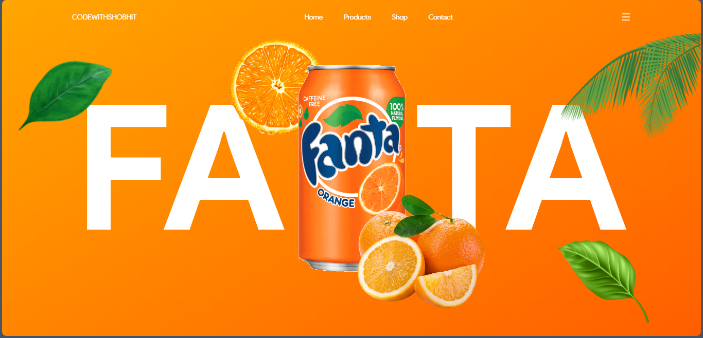

# Fanta Landing Page

**A vibrant, single-page landing site for the Fanta Orange brand, built with pure HTML & CSS.**



[](#)
[](#)
[](#)
[](./LICENSE)

---

## 📖 About the project

**Fanta Landing Page** is a bold, fruit-themed hero landing page inspired by the Fanta Orange brand identity. It features a bright orange background, oversized typography, a floating soda can, and decorative citrus and leaf illustrations to create an eye-catching, energetic first impression.

## ✨ Features

- 🍊 Large, playful hero section with layered product imagery (can, orange slices, leaves)
- 🧭 Simple top navigation bar — **Home**, **Products**, **Shop**, **Contact**
- 📱 Responsive layout with a mobile menu toggle
- 🎨 Bold brand-accurate color palette and typography
- ⚡ Lightweight — pure HTML & CSS, no build step required

## 🖼️ Preview

| Homepage |
|:---:|
|  |

## 📂 Folder structure

```
Fanta-website-Landing-Page-main/
├── css/
│   └── style.css
├── img/
│   └── (product & decorative images)
├── js/
│   └── script.js
├── index.html
└── README.md
```

> ℹ️ Adjust this structure to match your actual project folders/files.

## 🚀 Getting started

1. Download or clone the project folder.
2. Open `index.html` directly in your browser, **or**
3. Serve it locally for the best experience (recommended, to avoid asset path issues):
   ```bash
   npx serve .
   ```
   or use a tool like VS Code's **Live Server** extension.
4. Customize colors, images, and copy inside `index.html` / `css/style.css` to fit your needs.

## 🛠️ Tech stack

- **HTML5** — page structure
- **CSS3** — styling and layout
- **JavaScript** — (optional) interactivity such as the mobile menu

## 🙌 Credits

Design/tutorial inspiration: **CodeWithShobhit**

## 📄 License

This project is distributed under the terms described in the [`LICENSE`](./LICENSE) file. Please review it before using any brand-related assets (Fanta name/logo) commercially — they belong to their respective trademark owners.

---

<p align="center">Made with 🍊 for learning & practice purposes</p>
